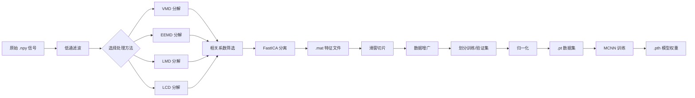

# 掘进机主轴承振动信号故障诊断系统

[](https://www.python.org/)
[](https://pytorch.org/)
[](https://www.riverbankcomputing.com/software/pyqt/)

## 📋 项目概述

这是一个基于**振动信号分析**和**深度学习**的故障诊断系统，专为掘进机主轴承设计。系统通过 **PyQt5 图形用户界面（GUI）**提供交互式操作，依次执行信号处理、特征提取、数据张量构建和 MCNN 模型训练，最终生成能够根据振动信号判断设备故障类型的深度学习模型。

### ✨ 核心特性

- **多方法支持**: 支持 6 种信号处理方法（LCD、FastICA、VMD、EEMD、LMD、None）
- **灵活组合**: 最多支持 4 种方法的任意顺序组合
- **智能分量选择**: 基于相关系数自动筛选有效分解分量
- **端到端流程**: 从原始数据到模型训练的全自动化处理
- **可视化界面**: 友好的 GUI 操作界面，无需编程基础
- **批处理支持**: 支持多样本批量处理和对比实验

### 🎯 应用场景

| 信号特征 | 推荐方法 | 典型场景 |
|---------|---------|---------|
| 强噪声环境 | VMD → FastICA | 轴承外圈故障诊断 |
| 非平稳、非线性 | EEMD → FastICA | 复杂工况振动分析 |
| 调频调幅信号 | LMD → FastICA | 齿轮箱故障诊断 |
| 一般振动信号 | LCD → FastICA | 常规故障诊断 |

## 🛠️ 技术栈

### 核心框架
- **GUI 框架**: PyQt5
- **深度学习**: PyTorch
- **科学计算**: NumPy, SciPy, scikit-learn
- **信号处理**: tqdm, nptdms

### 可选依赖（新增方法）
- **VMD**: `vmdpy` - 变分模态分解
- **EEMD**: `PyEMD` - 集成经验模态分解
- **LMD**: `PyLMD` - 局部均值分解

### 数据格式
- **原始数据**: `.npy` (NumPy 数组)
- **中间特征**: `.mat` (MATLAB 格式)
- **模型输入**: `.pt` (PyTorch Tensor)
- **模型权重**: `.pth` (PyTorch 模型)

## 📦 安装说明

### 1. 克隆仓库
```bash
git clone https://github.com/yourusername/LCD-FastICA-MCNN.git
cd LCD-FastICA-MCNN
```

### 2. 安装基础依赖
```bash
pip install numpy scipy matplotlib tqdm scikit-learn nptdms
pip install PyQt5
```

### 3. 安装 PyTorch（根据 CUDA 版本选择）
```bash
# CPU 版本
pip install torch torchvision torchaudio

# GPU 版本（推荐，CUDA 11.8）
pip install torch torchvision torchaudio --index-url https://download.pytorch.org/whl/cu118
```

### 4. 安装可选依赖（完整功能）
```bash
# 安装所有信号处理方法
pip install vmdpy PyEMD PyLMD
```

### 5. 验证安装
```bash
python src/lcd_fastica.py
```

预期输出：
```
============================================================
信号处理方法可用性检查
============================================================

VMD 方法：✓ 可用
EEMD 方法：✓ 可用
LMD 方法：✓ 可用

可用的处理方法列表:
  - None (无处理)
  - LCD (局部特征尺度分解)
  - FastICA (快速独立成分分析)
  - VMD (变分模态分解)
  - EEMD (集成经验模态分解)
  - LMD (局部均值分解)
============================================================
```

## 🚀 快速开始

### 方法一：GUI 界面操作（推荐）

#### 1. 启动程序
```bash
python src/main_window.py
```

#### 2. 操作步骤
1. **选择文件**: 点击"浏览"选择 `.npy` 格式的振动信号文件
2. **设置参数**: 
   - 采样率 (Hz): 默认 20000
   - 最大采样点数：默认 9142857
3. **配置处理方法**:
   - 步骤 1-4：每个步骤选择一种方法
   - 推荐组合：`VMD → FastICA` 或 `LCD → FastICA`
4. **选择标签**: 从 A-J 中选择对应故障类型
5. **添加至批处理**: 将当前配置加入处理队列
6. **选择训练模式**:
   - "第一次训练模型": 从头开始训练
   - "读取已有模型继续训练": 加载已有权重继续训练
7. **开始训练**: 执行整个流程

#### 3. 典型配置示例

**场景 1：轴承故障诊断（强噪声环境）**
```
步骤 1: VMD
步骤 2: FastICA
步骤 3: None
步骤 4: None
标签：A (正常状态)
```

**场景 2：齿轮箱故障诊断**
```
步骤 1: LMD
步骤 2: FastICA
步骤 3: None
步骤 4: None
标签：B (轻微故障)
```

**场景 3：方法对比实验**
对同一文件分别添加 4 个配置进行对比：
1. LCD → FastICA
2. VMD → FastICA
3. EEMD → FastICA
4. LMD → FastICA

### 方法二：Python 代码调用

```python
import numpy as np
from src.lcd_fastica import process_signal_pipeline

# 加载信号数据
signal = np.load('data/your_signal.npy')
fs = 20000  # 采样率

# 执行 VMD + FastICA 处理
process_signal_pipeline(
    file_path='data/your_signal.npy',
    output_path='processed_data/ica_results/output.mat',
    sampling_rate=fs,
    processing_methods=['VMD', 'FastICA'],
    num_components=5
)

# 构建张量数据集
from src.build_tensor import build_tensor_data
build_tensor_data(
    mat_files_dir='processed_data/ica_results',
    output_dir='processed_data/tensor_dataset',
    sample_length=1024
)

# 训练模型
from src.train_model import train_model
train_model(
    data_dir='processed_data/tensor_dataset',
    model_save_path='models/best_model.pth',
    epochs=50,
    batch_size=32
)
```

## 🏗️ 项目架构

### 目录结构
```
LCD-FastICA-MCNN/
├── data/                       # 原始 .npy 信号数据
│   ├── bearing_fault_1.npy
│   ├── bearing_fault_2.npy
│   └── ...
├── processed_data/             # 处理后的中间数据
│   ├── ica_results/           # LCD-FastICA 生成的 .mat 特征文件
│   └── tensor_dataset/        # 构建的 .pt 张量数据集与标签
├── models/                     # 训练好的模型权重 (.pth)
├── src/                        # 核心源代码
│   ├── main_window.py         # GUI 主程序 (PyQt5)
│   ├── lcd_fastica.py         # 信号处理核心 (6 种方法)
│   ├── build_tensor.py        # 张量构建与数据划分
│   ├── mcnn_model.py          # MCNN 神经网络定义
│   ├── train_model.py         # 模型训练脚本
│   └── signal_processing_methods.py  # 信号处理方法封装
├── 参考方法/                   # 参考实现代码
│   ├── 变分模态分解 VMD.py
│   ├── 局部均值分解 LMD.py
│   └── 集成经验模态分解 EEMD.py
├── README.md                  # 项目说明文档
├── PIPELINE_USAGE.md          # 管道使用详细指南
├── NEW_METHODS_EXAMPLES.md    # 新方法实战示例
├── QUICK_REFERENCE.md         # 快速参考卡
└── UPDATE_SUMMARY.md          # 更新日志汇总
```

### 核心模块说明

#### 1. GUI 交互模块 (`main_window.py`)
- **功能**: 图形界面总控制器
- **特性**:
  - 文件选择与参数设置
  - 4 步处理方法配置器
  - 批处理任务管理
  - 训练模式选择
  - 实时状态显示

#### 2. 信号处理模块 (`lcd_fastica.py`)
- **功能**: 信号降噪与特征提取
- **支持方法**:
  - **None**: 无处理，直接使用原信号
  - **LCD**: 局部特征尺度分解（默认方法）
  - **FastICA**: 快速独立成分分析（需多通道输入）
  - **VMD**: 变分模态分解（抗噪性强）✨
  - **EEMD**: 集成经验模态分解（自适应好）✨
  - **LMD**: 局部均值分解（适合调频调幅）✨
- **智能特性**:
  - 自动计算分量相关系数
  - 智能筛选有效分量（阈值 > 0.5）
  - 支持多级级联处理

#### 3. 数据构建模块 (`build_tensor.py`)
- **功能**: 特征融合与数据集构建
- **处理流程**:
  - 读取多个 `.mat` 特征文件
  - 滑窗切片提取样本
  - 数据增广（可选）
  - 按 80/20 划分训练集/验证集
  - 归一化处理（基于训练集统计）
  - 保存为 `.pt` 格式

#### 4. 模型定义模块 (`mcnn_model.py`)
- **网络结构**: MSASCnn (多尺度自适应卷积神经网络)
- **核心组件**:
  - **WideConvLayer**: 宽卷积层（128 和 64 双尺度核）
  - **MSASCblock**: 多尺度自适应卷积块（3 个并行卷积分支）
- **特点**: 适合一维时间序列特征提取

#### 5. 模型训练模块 (`train_model.py`)
- **功能**: 模型训练与验证
- **特性**:
  - CrossEntropy 损失函数
  - Adam 优化器
  - 学习率动态调整
  - 断点续训支持
  - 训练日志记录

## 📊 数据处理流程



### 详细步骤说明

#### 步骤 1: 信号读取与预处理
- 读取 `.npy` 格式的一维振动信号
- 应用低通滤波器去除高频噪声

#### 步骤 2: 信号分解（可选）
选择以下方法之一：
- **VMD**: 分解为 K 个本征模态函数 (IMF)
- **EEMD**: 自适应分解为 IMF 分量
- **LMD**: 分解为乘积函数 (PF) 分量
- **LCD**: 分解为内禀尺度分量 (ISC)

#### 步骤 3: 分量筛选
- 计算各分量与原信号的相关系数
- 自动选择相关系数 > 0.5 的分量
- 若无满足条件的分量，选择最相关的分量

#### 步骤 4: 盲源分离（可选）
- FastICA 进一步提取独立成分
- 提升特征的可分性

#### 步骤 5: 特征保存
- 输出 `.mat` 文件包含：
  - `ICA_Components`: 多通道特征信号
  - `Processing_Info`: 处理参数信息
  - `Processing_Steps`: 处理步骤记录

#### 步骤 6: 张量构建
- 从 `.mat` 文件读取特征
- 随机索引截取固定长度样本
- 组合为 `(N_samples, N_channels, sample_length)` 张量
- 生成对应的标签向量

#### 步骤 7: 数据集划分
- 80% 训练集，20% 验证集
- 基于训练集计算均值和标准差
- 对训练集和验证集分别归一化

#### 步骤 8: 模型训练
- 加载 MCNN 网络
- 执行训练 - 验证循环
- 保存最优模型权重

## 📈 性能对比

### 方法特性比较

| 方法 | 计算速度 | 内存占用 | 抗噪性 | 自适应性 | 适用场景 |
|------|---------|---------|--------|----------|---------|
| **LCD** | ⭐⭐⭐⭐ | ⭐⭐⭐⭐ | ⭐⭐⭐ | ⭐⭐⭐ | 一般故障诊断 |
| **VMD** | ⭐⭐⭐ | ⭐⭐⭐ | ⭐⭐⭐⭐⭐ | ⭐⭐⭐ | 强噪声环境 |
| **EEMD** | ⭐⭐ | ⭐⭐ | ⭐⭐⭐⭐ | ⭐⭐⭐⭐⭐ | 非平稳信号 |
| **LMD** | ⭐⭐⭐ | ⭐⭐⭐ | ⭐⭐⭐ | ⭐⭐⭐⭐ | 调频调幅信号 |

### 推荐策略
1. **初次使用**: 从默认的 `LCD → FastICA` 开始
2. **效果不佳**: 尝试其他 3 种方法对比
3. **最优选择**: 对同一数据集测试所有方法，选择精度最高的

## 🔧 参数调优指南

### VMD 参数
```python
K = 5              # 模态数量（建议 3-7，根据信号复杂度）
alpha = 2000       # 惩罚因子（高频信号 1000-2000，低频 2000-4000）
tau = 0.001        # 噪声容忍度（通常保持不变）
```

### EEMD 参数
```python
max_imf = 3        # 最大 IMF 数量（简单信号 2-3，复杂 4-6）
```

### LMD 参数
```python
# 自适应，无需手动设置
```

### 通用参数
```python
sampling_rate = 20000    # 采样率 (Hz)
max_samples = 9142857    # 最大采样点数
sample_length = 1024     # 切片样本长度
batch_size = 32          # 训练批次大小
epochs = 50              # 训练轮数
learning_rate = 0.001    # 学习率
```

## 📚 文档索引

- **README.md**: 项目总览和快速入门
- **PIPELINE_USAGE.md**: 详细的管道使用指南
- **NEW_METHODS_EXAMPLES.md**: 实战代码示例
- **QUICK_REFERENCE.md**: 快速参考卡
- **UPDATE_SUMMARY.md**: 更新日志和版本历史

## ❓ 常见问题

### Q1: 某些库未安装怎么办？
如果出现类似警告：
```
Warning: vmdpy not installed. VMD method will not be available.
```
**解决方案**: 安装对应库即可：
```bash
pip install vmdpy  # 或 PyEMD、PyLMD
```

### Q2: FastICA 为什么不能单独使用？
FastICA 需要**多通道输入**才能进行盲源分离。单通道信号必须先通过 VMD/EEMD/LMD/LCD 等方法分解成多通道。

### Q3: 如何选择最优方法？
**建议做法**: 对同一数据集，分别用 4 种方法处理，比较最终模型的分类准确率。

### Q4: EEMD 运行很慢正常吗？
**正常**。EEMD 计算量大是固有特点。可以：
- 减少 `max_imf` 值
- 截取部分信号（减少采样点数）
- 使用 GPU 加速

### Q5: 如何查看处理效果？
程序运行时会在控制台输出：
- 分解生成的分量数量
- 各分量与原信号的相关系数
- 重构误差
- 处理时间

### Q6: 支持哪些数据格式？
目前仅支持 `.npy` 格式的 NumPy 数组。如果是其他格式（如 CSV、MAT），需要先转换为 `.npy`。

## 🔬 算法原理简介

### LCD (局部特征尺度分解)
通过构建基线函数，将复杂信号分解为若干个内禀尺度分量 (ISC)，适合处理非平稳、非线性信号。

### FastICA (快速独立成分分析)
基于统计独立的盲源分离方法，通过最大化非高斯性提取独立成分，常用于特征增强和降维。

### VMD (变分模态分解)
通过变分优化问题将信号分解为多个本征模态函数 (IMF)，具有频率分辨率高、抗噪性强的优点。

### EEMD (集成经验模态分解)
在 EMD 基础上添加白噪声辅助，通过多次平均减轻模态混叠，适合非线性、非平稳信号分析。

### LMD (局部均值分解)
通过计算局部均值和包络函数得到乘积函数 (PF) 分量，直接处理调频调幅信号，瞬时频率具有物理意义。

## 📝 更新日志

### v2.0 (2026-03-31)
✨ **新增功能**:
- ✅ 新增 VMD (变分模态分解) 方法
- ✅ 新增 EEMD (集成经验模态分解) 方法
- ✅ 新增 LMD (局部均值分解) 方法
- ✅ 支持 4 步处理方法灵活组合
- ✅ 智能分量选择（基于相关系数）
- ✅ 新增测试脚本和示例文档

🔧 **优化改进**:
- 模块化管道架构，易于扩展
- 容错机制增强，依赖缺失不崩溃
- 向后兼容，不影响现有功能

### v1.0 (初始版本)
- ✅ 支持 LCD 和 FastICA 方法
- ✅ 基础 GUI 界面
- ✅ MCNN 模型训练

## 📖 参考资料

### 学术论文
1. **VMD**: Dragomiretskiy K, Zosso D. Variational mode decomposition[J]. IEEE Transactions on Signal Processing, 2013.
2. **EEMD**: Wu Z, Huang N E. Ensemble empirical mode decomposition: a noise-assisted data analysis method[J]. Advances in Adaptive Data Analysis, 2009.
3. **LMD**: Smith J S. The local mean decomposition and its application to EEG perception data[J]. Journal of the Royal Society Interface, 2005.
4. **LCD**: 相关论文待补充

### 开源项目
- [VMDPy](https://github.com/vmanuel/VMDPy)
- [PyEMD](https://pyemd.readthedocs.io/)
- [PyLMD](https://github.com/jkieferr/PyLMD)
- [PyTorch](https://pytorch.org/)

## 🤝 贡献指南

欢迎提交 Issue 和 Pull Request！

1. Fork 本项目
2. 创建特性分支 (`git checkout -b feature/AmazingFeature`)
3. 提交更改 (`git commit -m 'Add some AmazingFeature'`)
4. 推送到分支 (`git push origin feature/AmazingFeature`)
5. 开启 Pull Request

## 📄 许可证

本项目采用 MIT 许可证 - 查看 [LICENSE](LICENSE) 文件了解详情。

## 👥 作者

- 掘进机主轴承故障诊断项目组

## 🙏 致谢

感谢所有为此项目做出贡献的开发者和研究人员！

---

**提示**: 如果本文档与实际代码有出入，请以实际代码为准。如有发现文档错误，欢迎提交 Issue 或 PR 进行修正。
