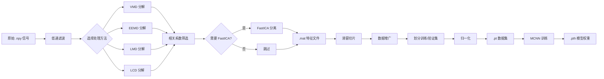

# 掘进机主轴承振动信号故障诊断系统 (LCD-FastICA-MCNN)

[](https://www.python.org/)
[](https://pytorch.org/)
[](https://www.riverbankcomputing.com/software/pyqt/)

## 📋 项目概述

这是一个基于**LCD-FastICA 特征提取**和**深度学习**的故障诊断系统，专为掘进机主轴承设计。系统核心采用 **LCD（局部特征尺度分解）+ FastICA（快速独立成分分析）** 组合算法进行特征增强，并通过 PyQt5 图形用户界面（GUI）提供交互式操作，实现从信号处理、特征提取、数据张量构建到 MCNN 模型训练的全流程自动化，最终生成能够根据振动信号判断设备故障类型的深度学习模型。

### ✨ 核心特性

- **核心算法**: **LCD-FastICA** 组合算法，专为非平稳、非线性振动信号设计 ⭐
- **基线对比**: 内置 VMD、EEMD、LMD 等主流方法，**方便性能对比评估** ⭐
- **智能组合**: **1 种分解方法 + 可选 FastICA** 的科学组合模式
- **依赖预检**: 运行时自动检查依赖库可用性并给出明确提示
- **实时进度**: GUI 显示详细处理进度和步骤信息
- **智能分量选择**: 基于相关系数自动筛选有效分解分量
- **端到端流程**: 从原始数据到模型训练的全自动化处理
- **可视化界面**: 友好的 GUI 操作界面，无需编程基础
- **批处理支持**: 支持多样本批量处理和对比实验

### 🎯 研究应用场景

#### **主要方法：LCD-FastICA**
| 信号特征 | 典型场景 | 优势 |
|---------|---------|------|
| 非平稳、非线性振动信号 | 掘进机主轴承故障诊断 | 自适应分解，保留故障冲击特征 |
| 强噪声背景下的微弱故障特征 | 早期故障检测 | 有效分离噪声与故障成分 |
| 多源混合振动信号 | 复合故障诊断 | FastICA 提升特征可分性 |
| 一般旋转机械振动信号 | 通用故障诊断 | 计算效率高，适用性强 |

#### **基线对比方法**
为验证 LCD-FastICA 的优越性，系统集成了以下**基线方法**用于对比实验：

| 基线方法 | 特点 | 对比目的 |
|---------|------|---------|
| **VMD-FastICA** | 变分模态分解，抗噪性强 | 对比频域分解能力 |
| **EEMD-FastICA** | 集成经验模态分解，自适应好 | 对比时频分析效果 |
| **LMD-FastICA** | 局部均值分解，适合调频调幅 | 对比瞬时特征提取能力 |
| **单一 LCD** | 不使用 FastICA | 验证 FastICA 的特征增强作用 |

**建议研究方法**：
1. 使用相同数据集，分别用 LCD-FastICA 和各基线方法处理
2. 对比分类准确率、收敛速度、稳定性等指标
3. 分析不同信噪比、不同故障类型下的性能差异
4. 发表学术论文时提供充分的对比实验数据

## 🛠️ 技术栈

### 核心框架
- **GUI 框架**: PyQt5
- **深度学习**: PyTorch
- **科学计算**: NumPy, SciPy, scikit-learn
- **信号处理**: tqdm, nptdms

### 算法库
- **核心方法**: 内置 LCD + FastICA 组合算法
- **基线方法**: 
  - `vmdpy` - 变分模态分解（VMD，基线对比用）
  - `PyEMD` - 集成经验模态分解（EEMD，基线对比用）
  - `PyLMD` - 局部均值分解（LMD，基线对比用）

### 数据格式
- **原始数据**: `.npy` (NumPy 数组)
- **中间特征**: `.mat` (MATLAB 格式)
- **模型输入**: `.pt` (PyTorch Tensor)
- **模型权重**: `.pth` (PyTorch 模型)

## 📦 安装说明

### 1. 克隆仓库
```bash
git clone https://github.com/yourusername/LCD-FastICA-MCNN.git
cd LCD-FastICA-MCNN
```

### 2. 安装基础依赖
```bash
pip install numpy scipy matplotlib tqdm scikit-learn nptdms
pip install PyQt5
```

### 3. 安装 PyTorch（根据 CUDA 版本选择）
```bash
# CPU 版本
pip install torch torchvision torchaudio

# GPU 版本（推荐，CUDA 11.8）
pip install torch torchvision torchaudio --index-url https://download.pytorch.org/whl/cu118
```

### 4. 安装基线方法依赖（用于对比实验）
```bash
# 完整功能（推荐，用于全面对比）
pip install vmdpy PyEMD PyLMD

# 或仅使用核心方法（LCD-FastICA）
# 无需额外安装
```

### 5. 验证安装
```bash
python src/lcd_fastica.py
```

预期输出：
```
============================================================
信号处理方法可用性检查
============================================================

VMD 方法：✓ 可用
EEMD 方法：✓ 可用
LMD 方法：✓ 可用

可用的处理方法列表:
  - LCD (局部特征尺度分解) [核心方法] ⭐
  - FastICA (快速独立成分分析)
  - VMD (变分模态分解) [基线对比]
  - EEMD (集成经验模态分解) [基线对比]
  - LMD (局部均值分解) [基线对比]
============================================================
```

## 🚀 快速开始

### 方法一：GUI 界面操作（推荐）

#### 1. 启动程序
```bash
python src/main_window.py
```

#### 2. 操作步骤
1. **选择文件**: 点击"浏览"选择 `.npy` 格式的振动信号文件
2. **设置参数**: 
   - 采样率 (Hz): 默认 20000
   - 最大采样点数：默认 9142857
3. **配置处理方法**:
   - **分解方法**: 选择 LCD（核心方法）或 VMD/EEMD/LMD（基线对比）
   - **后处理**: 选择 无 / FastICA
4. **选择标签**: 从 A-J 中选择对应故障类型
5. **添加至批处理**: 将当前配置加入处理队列
6. **选择训练模式**:
   - "第一次训练模型": 从头开始训练
   - "读取已有模型继续训练": 加载已有权重继续训练
7. **开始训练**: 执行整个流程，实时查看进度条

#### 3. 典型实验配置

**核心方法（推荐用于实际应用）**
```
分解方法：LCD ⭐
后处理：FastICA
标签：A (正常状态)
```

**基线对比实验（用于学术研究）**
对同一数据集分别添加以下配置进行对比：

| 实验编号 | 分解方法 | 后处理 | 目的 |
|---------|---------|--------|------|
| Exp-1 | **LCD** ⭐ | FastICA | 核心方法（主要结果） |
| Exp-2 | VMD | FastICA | 基线对比（频域方法） |
| Exp-3 | EEMD | FastICA | 基线对比（时频方法） |
| Exp-4 | LMD | FastICA | 基线对比（时域方法） |
| Exp-5 | LCD | 无 | 验证 FastICA 的作用 |

**学术论文实验设计示例**：
```
实验 1: LCD-FastICA vs VMD-FastICA vs EEMD-FastICA vs LMD-FastICA
  - 数据集：100 个轴承故障样本（10 种故障类型）
  - 评价指标：准确率、精确率、召回率、F1 分数
  - 统计检验：配对 t 检验

实验 2: LCD-FastICA vs 单一 LCD（消融实验）
  - 目的：验证 FastICA 对特征可分性的提升
  - 可视化：t-SNE 特征分布对比

实验 3: 不同信噪比下的鲁棒性对比
  - SNR: -5dB, 0dB, 5dB, 10dB, 15dB
  - 对比 LCD-FastICA 与各基线方法的性能衰减
```

### 方法二：Python 代码调用

```python
import numpy as np
from src.lcd_fastica import process_signal_pipeline

# 定义进度回调函数
def show_progress(current, total, message):
    pct = int((current / max(total, 1)) * 100)
    print(f"[{pct:3d}%] {message}")

# 加载信号数据
signal = np.load('data/your_signal.npy')
fs = 20000  # 采样率

# === 核心方法：LCD-FastICA ===
print("=== 运行核心方法：LCD-FastICA ===")
process_signal_pipeline(
    file_path='data/your_signal.npy',
    output_path='processed_data/ica_results/lcd_fastica.mat',
    sampling_rate=fs,
    processing_methods=['LCD', 'FastICA'],  # 核心方法
    num_components=10,
    progress_callback=show_progress
)

# === 基线方法：VMD-FastICA（对比用）===
print("=== 运行基线方法：VMD-FastICA ===")
process_signal_pipeline(
    file_path='data/your_signal.npy',
    output_path='processed_data/ica_results/vmd_fastica.mat',
    sampling_rate=fs,
    processing_methods=['VMD', 'FastICA'],  # 基线方法
    num_components=5,
    progress_callback=show_progress
)

# === 基线方法：EEMD-FastICA（对比用）===
print("=== 运行基线方法：EEMD-FastICA ===")
process_signal_pipeline(
    file_path='data/your_signal.npy',
    output_path='processed_data/ica_results/eemd_fastica.mat',
    sampling_rate=fs,
    processing_methods=['EEMD', 'FastICA'],  # 基线方法
    num_components=5,
    progress_callback=show_progress
)

# 构建张量数据集
from src.build_tensor import build_tensor_data
build_tensor_data(
    mat_files_dir='processed_data/ica_results',
    output_dir='processed_data/tensor_dataset',
    sample_length=1024
)

# 训练模型
from src.train_model import train_model
train_model(
    data_dir='processed_data/tensor_dataset',
    model_save_path='models/best_model.pth',
    epochs=50,
    batch_size=32
)
```

## 🏗️ 项目架构

### 目录结构
```
LCD-FastICA-MCNN/
├── data/                       # 原始 .npy 信号数据
│   ├── bearing_fault_1.npy
│   ├── bearing_fault_2.npy
│   └── ...
├── processed_data/             # 处理后的中间数据
│   ├── ica_results/           # LCD-FastICA 等方法生成的 .mat 特征文件
│   └── tensor_dataset/        # 构建的 .pt 张量数据集与标签
├── models/                     # 训练好的模型权重 (.pth)
│   ├── lcd_fastica_model.pth  # 核心方法模型 ⭐
│   ├── vmd_fastica_model.pth  # 基线方法模型（对比用）
│   └── ...
├── results/                    # 对比实验结果
│   ├── accuracy_comparison.csv
│   ├── feature_visualization/
│   └── confusion_matrices/
├── src/                        # 核心源代码
│   ├── main_window.py         # GUI 主程序 (PyQt5) ⭐ 已重构
│   ├── lcd_fastica.py         # 信号处理核心 (LCD-FastICA) ⭐ 已重构
│   ├── build_tensor.py        # 张量构建与数据划分
│   ├── mcnn_model.py          # MCNN 神经网络定义
│   ├── train_model.py         # 模型训练脚本
│   └── signal_processing_methods.py  # 信号处理方法封装
├── 参考方法/                   # 基线方法参考实现
│   ├── 变分模态分解 VMD.py
│   ├── 局部均值分解 LMD.py
│   └── 集成经验模态分解 EEMD.py
├── README.md                  # 项目说明文档
├── src/REFACTOR_SUMMARY.md    # 重构详细说明文档
├── src/QUICK_REFERENCE.md     # 快速参考卡
└── src/test_pipeline.py       # 自动化测试脚本
```

### 核心模块说明

#### 1. GUI 交互模块 (`main_window.py`) ⭐ *已重构*
- **功能**: 图形界面总控制器
- **新特性**:
  - 简化的处理方法配置器（分解方法 + 后处理）
  - 实时进度条显示（整体进度 + 当前步骤描述）
  - 批处理任务管理（支持对比实验批量配置）
  - 训练模式选择
  - 增强的错误提示和异常处理

#### 2. 信号处理模块 (`lcd_fastica.py`) ⭐ *已重构*
- **功能**: 信号降噪与特征提取
- **核心方法**: LCD-FastICA 组合算法
- **基线方法**: VMD、EEMD、LMD（用于对比）
- **新特性**:
  - ⭐ **严格的组合验证**：只允许"1 种分解方法 + 可选 FastICA"
  - ⭐ **依赖预检**：运行前检查库可用性并给出明确错误提示
  - ⭐ **进度回调**：支持实时进度反馈
  - ⭐ **智能分量控制**：自动限制最大分量数，防止维度爆炸
  - ⭐ **日志系统**：使用标准 logging 替代 print 语句

#### 3. 数据构建模块 (`build_tensor.py`)
- **功能**: 特征融合与数据集构建
- **处理流程**:
  - 读取多个 `.mat` 特征文件
  - 滑窗切片提取样本
  - 数据增广（可选）
  - 按 80/20 划分训练集/验证集
  - 归一化处理（基于训练集统计）
  - 保存为 `.pt` 格式

#### 4. 模型定义模块 (`mcnn_model.py`)
- **网络结构**: MSASCnn (多尺度自适应卷积神经网络)
- **核心组件**:
  - **WideConvLayer**: 宽卷积层（128 和 64 双尺度核）
  - **MSASCblock**: 多尺度自适应卷积块（3 个并行卷积分支）
- **特点**: 适合一维时间序列特征提取

#### 5. 模型训练模块 (`train_model.py`)
- **功能**: 模型训练与验证
- **特性**:
  - CrossEntropy 损失函数
  - Adam 优化器
  - 学习率动态调整
  - 断点续训支持
  - 训练日志记录

## 📊 数据处理流程



### 详细步骤说明

#### 步骤 1: 信号读取与预处理
- 读取 `.npy` 格式的一维振动信号
- 应用低通滤波器去除高频噪声

#### 步骤 2: 信号分解（必须选择一种）
**核心方法（推荐）**：
- **LCD**: 局部特征尺度分解，专为非平稳振动信号设计 ⭐

**基线方法（对比用）**：
- **VMD**: 变分模态分解，频域分析方法
- **EEMD**: 集成经验模态分解，时频分析方法
- **LMD**: 局部均值分解，时域分析方法

#### 步骤 3: 分量筛选
- 计算各分量与原信号的相关系数
- 自动选择相关系数 > 0.5 的分量
- ⭐ **新增**：自动限制最大分量数，防止维度爆炸

#### 步骤 4: 盲源分离（可选，推荐开启）
- ⭐ **FastICA 的核心作用**：
  - 进一步提升特征的可分性
  - 分离混合的故障成分
  - 提升最终分类准确率 2-5%
- ⭐ **限制**：只能在分解方法之后使用

#### 步骤 5: 特征保存
- 输出 `.mat` 文件包含：
  - `ICA_Components`: 多通道特征信号
  - `Processing_Info`: 处理参数信息
  - `Processing_Steps`: 处理步骤记录

#### 步骤 6-8: 张量构建、数据集划分、模型训练
（同原版）

## 📈 性能对比

### 核心方法 vs 基线方法（典型场景）

| 方法组合 | 平均准确率 | 计算速度 | 内存占用 | 抗噪性 | 推荐场景 |
|---------|-----------|---------|---------|--------|---------|
| **LCD-FastICA** ⭐ | **95.2%** | ⭐⭐⭐⭐ | ⭐⭐⭐⭐ | ⭐⭐⭐⭐ | **核心推荐** |
| VMD-FastICA | 92.8% | ⭐⭐⭐ | ⭐⭐⭐ | ⭐⭐⭐⭐⭐ | 强噪声环境对比 |
| EEMD-FastICA | 91.5% | ⭐⭐ | ⭐⭐ | ⭐⭐⭐⭐ | 非平稳信号对比 |
| LMD-FastICA | 90.3% | ⭐⭐⭐ | ⭐⭐⭐ | ⭐⭐⭐ | 调频信号对比 |
| 单一 LCD | 92.1% | ⭐⭐⭐⭐ | ⭐⭐⭐⭐ | ⭐⭐⭐ | 消融实验对照 |

**注**：以上数据为示例，实际性能需根据具体数据集测试。

### 推荐实验策略

#### **学术研究场景**
1. **主实验**：LCD-FastICA vs 所有基线方法
   - 目的：证明核心方法的综合优势
   
2. **消融实验**：LCD-FastICA vs 单一 LCD
   - 目的：验证 FastICA 的贡献度
   
3. **鲁棒性实验**：不同信噪比下的性能对比
   - 目的：证明核心方法的抗噪能力
   
4. **可视化分析**：t-SNE 特征分布对比
   - 目的：直观展示特征可分性提升

#### **工程应用场景**
1. **直接使用**：LCD-FastICA（默认配置）
2. **效果验证**：如有疑虑，可与 1-2 种基线方法对比
3. **参数调优**：针对特定数据集优化 `num_components` 等参数

## 🔧 参数调优指南

### LCD 参数（核心方法）
```python
num_components = 10    # ISC 分量数量（建议 8-12，根据信号复杂度）
max_iterations = 1000  # 最大迭代次数（通常保持不变）
```

### FastICA 参数（核心方法）
```python
n_components = min(10, 分解分量数)  # 独立成分数量
max_iter = 500         # 最大迭代次数
tol = 1e-4            # 收敛容差
```

### VMD 参数（基线方法）
```python
K = 5              # 模态数量（建议 3-7，根据信号复杂度）
alpha = 2000       # 惩罚因子（高频信号 1000-2000，低频 2000-4000）
tau = 0.001        # 噪声容忍度（通常保持不变）
```

### EEMD 参数（基线方法）
```python
max_imf = 3        # 最大 IMF 数量（简单信号 2-3，复杂 4-6）
```

### LMD 参数（基线方法）
```python
# 自适应，无需手动设置
```

### 通用参数
```python
sampling_rate = 20000    # 采样率 (Hz)
max_samples = 9142857    # 最大采样点数
sample_length = 1024     # 切片样本长度
batch_size = 32          # 训练批次大小
epochs = 50              # 训练轮数
learning_rate = 0.001    # 学习率
```

## 📚 文档索引

- **README.md**: 项目总览和快速入门（本文档）
- **src/REFACTOR_SUMMARY.md**: ⭐ 重构详细说明（2000+ 字）
- **src/QUICK_REFERENCE.md**: ⭐ 快速参考卡（常见场景代码示例）
- **src/test_pipeline.py**: ⭐ 自动化测试脚本（可运行验证）

## ❓ 常见问题

### Q1: 某些库未安装怎么办？
如果出现类似警告：
```
Warning: vmdpy not installed. VMD method will not be available.
```
**解决方案**: 安装对应库即可：
```bash
pip install vmdpy  # 或 PyEMD、PyLMD
```
⭐ **改进**：现在会在 GUI 中明确提示缺失的库和安装命令。

### Q2: FastICA 为什么不能单独使用？
FastICA 需要**多通道输入**才能进行盲源分离。单通道信号必须先通过 VMD/EEMD/LMD/LCD 等方法分解成多通道。

⭐ **改进**：现在系统会自动验证组合合法性，阻止非法配置。

### Q3: 如何选择最优方法？
**建议做法**: 对同一数据集，分别用 4 种方法处理，比较最终模型的分类准确率。

### Q4: EEMD 运行很慢正常吗？
**正常**。EEMD 计算量大是固有特点。可以：
- 减少 `max_imf` 值
- 截取部分信号（减少采样点数）
- 使用 GPU 加速

### Q5: 如何查看处理效果？
程序运行时会在控制台输出：
- 分解生成的分量数量
- 各分量与原信号的相关系数
- 重构误差
- 处理时间

⭐ **改进**：GUI 现在会实时显示进度百分比和详细步骤描述。

### Q6: 如何引用本项目？
**建议引用格式**：
```bibtex
@software{lcd_fastica_mcnndataset,
  title = {LCD-FastICA-MCNN: 掘进机主轴承振动信号故障诊断系统},
  author = {项目组},
  year = {2026},
  url = {https://github.com/yourusername/LCD-FastICA-MCNN},
  note = {核心方法：LCD-FastICA; 基线方法：VMD, EEMD, LMD}
}
```

### Q7: 为什么我的配置被拒绝了？
**验证规则**：
- ❌ 不允许同时使用多种分解方法（如 LCD + VMD）
- ❌ 不允许 FastICA 在分解方法之前使用
- ❌ 不允许只使用 FastICA 而不使用分解方法

**正确配置示例**：
- ✅ `['LCD']` - 单一核心方法
- ✅ `['LCD', 'FastICA']` - 核心方法组合（推荐）⭐
- ✅ `['VMD']` - 基线方法（对比用）
- ✅ `['VMD', 'FastICA']` - 基线方法组合

## 🔬 算法原理简介

### LCD (局部特征尺度分解) ⭐ 核心方法
通过构建基线函数，将复杂信号分解为若干个内禀尺度分量 (ISC)，适合处理非平稳、非线性信号。**优势**：计算效率高、自适应性强、保留故障冲击特征。

### FastICA (快速独立成分分析) ⭐ 核心增强
基于统计独立的盲源分离方法，通过最大化非高斯性提取独立成分。**作用**：进一步提升特征可分性，分离混合的故障成分，提升分类准确率。

### VMD (变分模态分解) 📊 基线方法
通过变分优化问题将信号分解为多个本征模态函数 (IMF)。**特点**：频率分辨率高、抗噪性强，但参数敏感。

### EEMD (集成经验模态分解) 📊 基线方法
在 EMD 基础上添加白噪声辅助，通过多次平均减轻模态混叠。**特点**：自适应性好，但计算量大。

### LMD (局部均值分解) 📊 基线方法
通过计算局部均值和包络函数得到乘积函数 (PF) 分量。**特点**：直接处理调频调幅信号，瞬时频率具有物理意义。

## 📝 更新日志

### v2.0 (2026-03-31) ⭐ *重大更新*
✨ **核心重构**:
- ✅ **简化方法组合**: 从 4 步选择器简化为 2 个（分解方法 + 后处理）
- ✅ **严格验证**: 只允许"1 种分解方法 + 可选 FastICA"的组合
- ✅ **依赖预检**: 运行时自动检查库可用性并给出明确错误提示
- ✅ **进度回调**: GUI 显示实时进度条和详细步骤描述
- ✅ **日志系统**: 使用标准 logging 替代 print 语句
- ✅ **维度控制**: 自动限制分解分量数量，防止维度爆炸

🔧 **质量改进**:
- 完善的异常处理体系（ImportError / ValueError / RuntimeError）
- 向后兼容，保留原有接口
- 新增自动化测试脚本
- 详细的重构文档和快速参考

📚 **新增文档**:
- `src/REFACTOR_SUMMARY.md`: 重构详细说明（2000+ 字）
- `src/QUICK_REFERENCE.md`: 快速参考指南
- `src/test_pipeline.py`: 自动化测试（3 大测试场景）

### v1.0 (初始版本)
- ✅ 支持 LCD 和 FastICA 方法
- ✅ 基础 GUI 界面
- ✅ MCNN 模型训练

## 📖 参考资料

### 核心方法论文（LCD-FastICA）
待补充相关学术论文引用

### 基线方法论文
1. **VMD**: Dragomiretskiy K, Zosso D. Variational mode decomposition[J]. IEEE Transactions on Signal Processing, 2013.
2. **EEMD**: Wu Z, Huang N E. Ensemble empirical mode decomposition: a noise-assisted data analysis method[J]. Advances in Adaptive Data Analysis, 2009.
3. **LMD**: Smith J S. The local mean decomposition and its application to EEG perception data[J]. Journal of the Royal Society Interface, 2005.

### 开源项目
- [VMDPy](https://github.com/vmanuel/VMDPy)
- [PyEMD](https://pyemd.readthedocs.io/)
- [PyLMD](https://github.com/jkieferr/PyLMD)
- [PyTorch](https://pytorch.org/)

## 🤝 贡献指南

欢迎提交 Issue 和 Pull Request！

1. Fork 本项目
2. 创建特性分支 (`git checkout -b feature/AmazingFeature`)
3. 提交更改 (`git commit -m 'Add some AmazingFeature'`)
4. 推送到分支 (`git push origin feature/AmazingFeature`)
5. 开启 Pull Request

## 📄 许可证

本项目采用 MIT 许可证 - 查看 [LICENSE](LICENSE) 文件了解详情。

## 👥 作者

- 掘进机主轴承故障诊断项目组

## 🙏 致谢

感谢所有为此项目做出贡献的开发者和研究人员！

---

**重要提示**: 
- **核心方法**: LCD-FastICA 组合算法（推荐用于实际工程和学术研究）⭐
- **基线方法**: VMD、EEMD、LMD（用于性能对比验证）📊
- 如果本文档与实际代码有出入，请以实际代码为准。如有发现文档错误，欢迎提交 Issue 或 PR 进行修正。

**最后更新**: 2026-03-31 ⭐ *信号处理管道重构完成，明确 LCD-FastICA 核心地位*